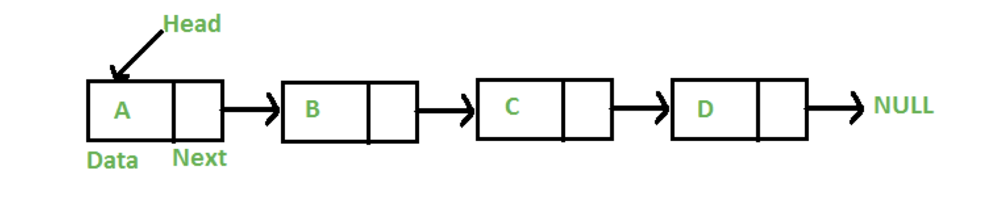
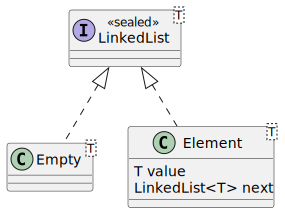

== Pattern Matching in Java

=== Aufgabe: LinkedList in Java implementieren

Implementierung einer LinkedList mit algebraischen Datentypen in Java. Inspiriert durch https://github.com/MBoegers/TreeExperiments/tree/main/SingleLinkedListJFP/src/main/java/io/github/mboegers/list/jfp[LinkedList-Beispiel] von https://github.com/MBoegers[Merlin Bögershausen].

Die LinkedList ist einmal objektorientiert (Package `pattern.matching.list.oo`) und einmal funktional (Package `pattern.matching.list.fp`) implementiert.

In der funktionalen Variante bauen wir einen algebraischen Datentyp.

. Schaut Euch zunächst die objektorientierte Implementierung an? Wie funktioniert Sie? Führt den Test aus:

`src/test/java/pattern/matching/list/oo/LinkedListTest.java`

Beim funktionalen Beispiel ist der Datentyp ebenfalls bereits implementiert: `src/main/java/pattern/matching/list/fp/LinkedList.java`.

. Schaut Euch die Funktionsweise des algebraischen Datentyps LinkedList an.

. Programmiert die bereits vorhandenen Funktionen `head`, `tail` und `contains` aus. Verwendet dafür switch-Expessions, Type-, Record- und Unnamed Patterns.
